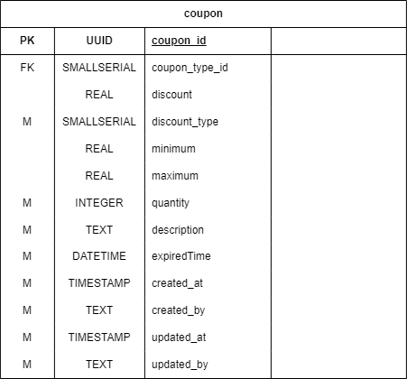
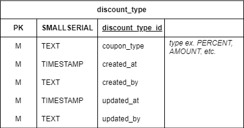

# Coupon service

### Overview

<figure><figcaption>
Database for coupon service
</figcaption></figure>

### coupon table

<figure><figcaption>
coupon table
</figcaption></figure>

Table สำหรับเก็บข้อมูลของ Coupon

### coupon\_type table

<figure><figcaption>
coupon_type table
</figcaption></figure>

Table สำหรับเก็บประเภทของ Coupon เช่น Discount, Shipping

### discount\_type table

<figure><figcaption>
discount_type table
</figcaption></figure>

Table สำหรับเก็บเงื่อนไขของการลดราคา เช่น ลดเป็น percentage หรือ 5 บาท/10บาท
