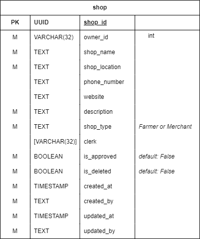
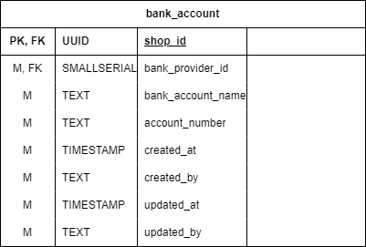
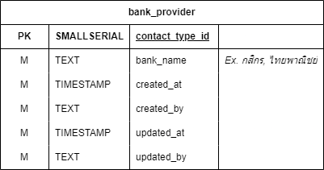
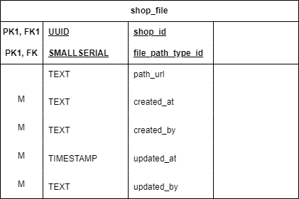

# Shop service

### Overview

<figure><figcaption>
Database for shop service
</figcaption></figure>

Database สำหรับเก็บข้อมูลที่เกี่ยวข้องกับ Shop อยู่ภายใต้ Shop service

### Shop table

<figure><figcaption>
shop_table
</figcaption></figure>

Table สำหรับเก็บข้อมูลทั่วไปเกี่ยวกับร้านค้า

### bank\_account table

<figure><figcaption>
bank_account table
</figcaption></figure>

Table สำหรับเก็บรายละเอียด Bank account ของร้านค้า

### bank\_provider table

<figure><figcaption>
bank_provider table
</figcaption></figure>

Table สำหรับเก็บข้อมูลของธนาคารต่าง ๆ

### shop\_file table

<figure><figcaption>
shop_file table
</figcaption></figure>

Table สำหรับเก็บ Path ของรูปภาพที่ทางร้านค้าได้ Upload เข้ามาในระบบ

### file\_path\_type table

<figure><figcaption>
file_path_type table
</figcaption></figure>

Table สำหรับเก็บประเภทของรูปภาพที่ทางร้านค้าได้ Upload มา เช่น Logo ร้านค้า, หน้า Book bank
