# User interface

* Sign-up page

<figure><figcaption></figcaption></figure>

 

<figure><figcaption></figcaption></figure>

* Sign-in page

<figure><figcaption></figcaption></figure>

* Browsing Dashbaord
  * Suggested species
  * Suggested products

<figure><figcaption></figcaption></figure>

 

<figure><figcaption></figcaption></figure>

* Browsing shop

<figure><figcaption></figcaption></figure>

 

<figure><figcaption></figcaption></figure>

* Browsing product

<figure>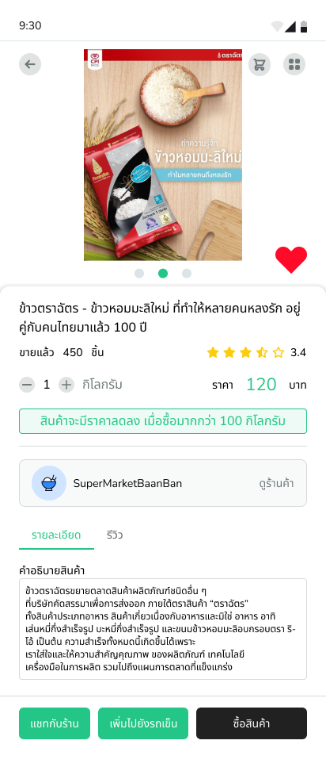<figcaption></figcaption></figure>

 

<figure>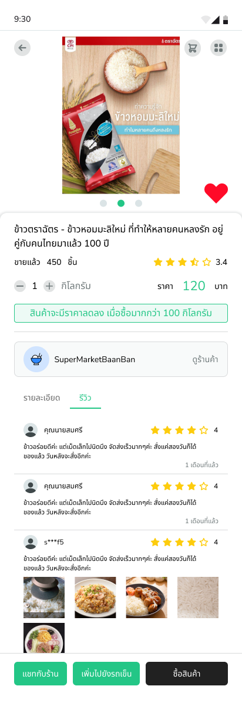<figcaption></figcaption></figure>

* Search with text

<figure><figcaption></figcaption></figure>

 

<figure>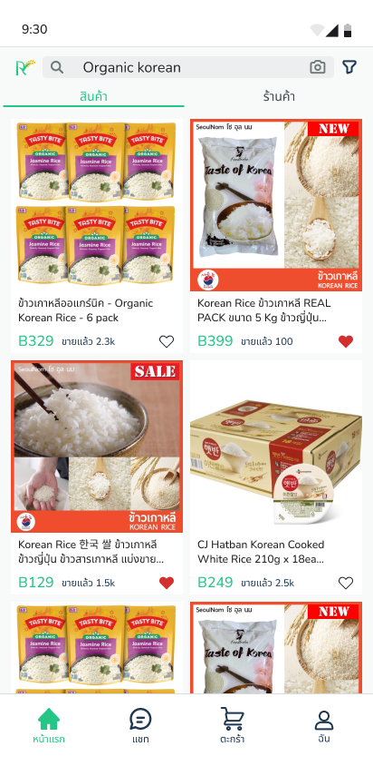<figcaption></figcaption></figure>

 

<figure>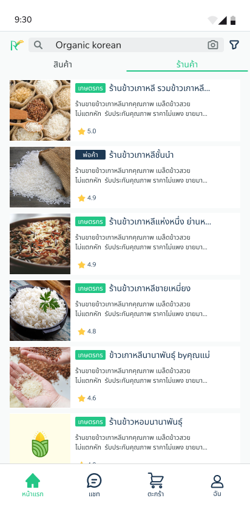<figcaption></figcaption></figure>

* Search with photo \*ML

<figure><figcaption></figcaption></figure>

 

<figure><figcaption></figcaption></figure>

 

<figure><figcaption></figcaption></figure>

* Cart

<figure><figcaption></figcaption></figure>

* Coupon

<figure><figcaption></figcaption></figure>

* Payment

<figure>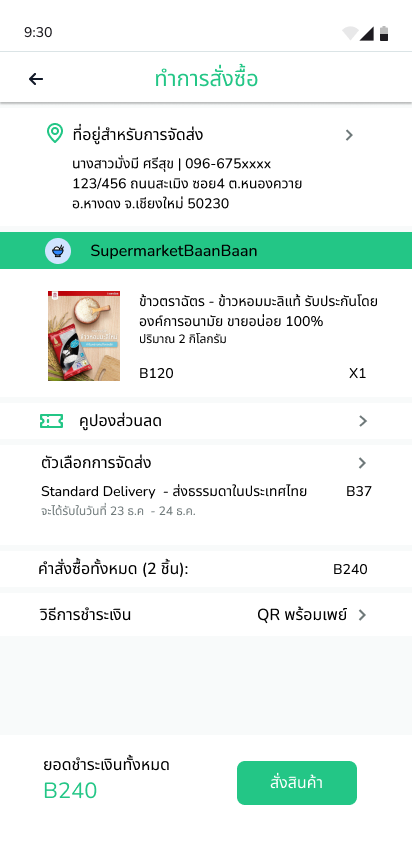<figcaption></figcaption></figure>

 

<figure>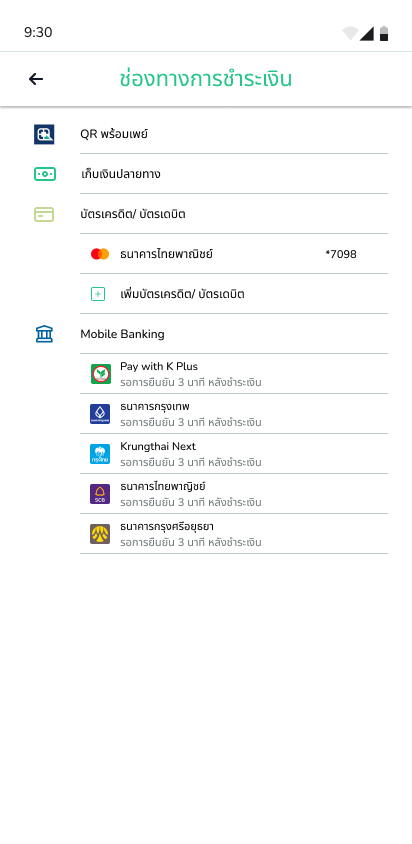<figcaption></figcaption></figure>

<figure>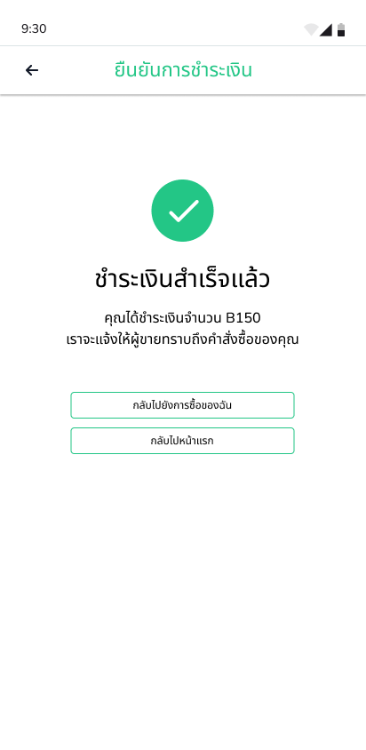<figcaption></figcaption></figure>

 

<figure>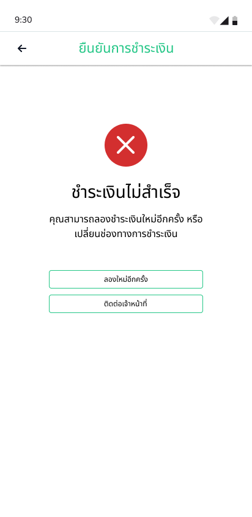<figcaption></figcaption></figure>

* Account Dashboard

<figure><figcaption></figcaption></figure>

* Account

<figure>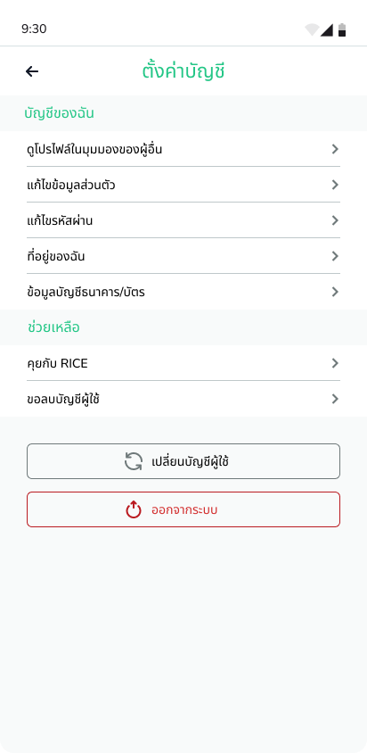<figcaption></figcaption></figure>

 

<figure><figcaption></figcaption></figure>

* User View History

<figure><figcaption></figcaption></figure>

* User Order History

<figure><figcaption></figcaption></figure>

 

<figure><figcaption></figcaption></figure>

 

<figure><figcaption></figcaption></figure>

* Review

<figure><figcaption></figcaption></figure>

* Favorite shops

<figure><figcaption></figcaption></figure>

* Favorite products

<figure><figcaption></figcaption></figure>

* Chat

<figure>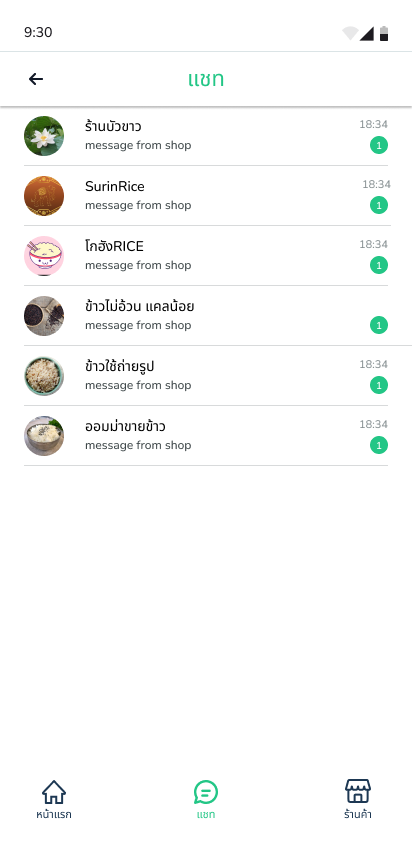<figcaption></figcaption></figure>

 

<figure>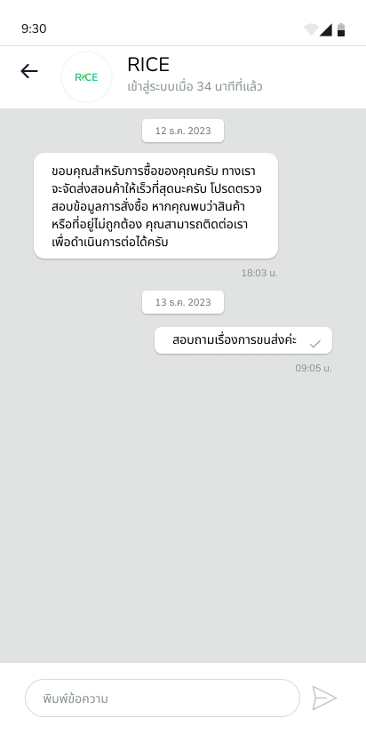<figcaption></figcaption></figure>

* Switch accounts

<figure><figcaption></figcaption></figure>

