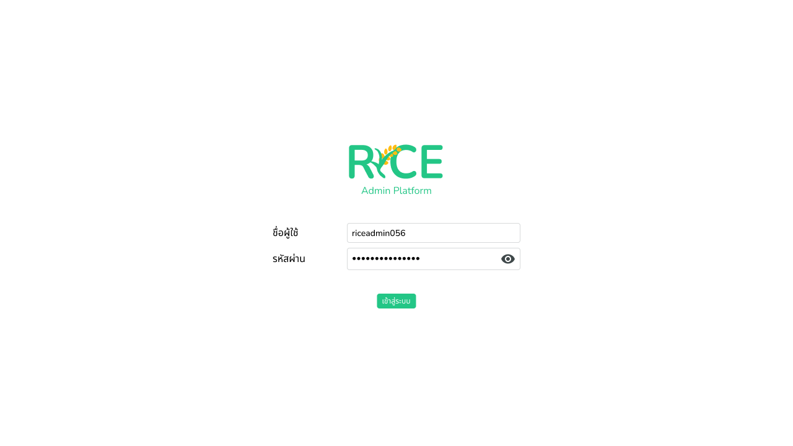
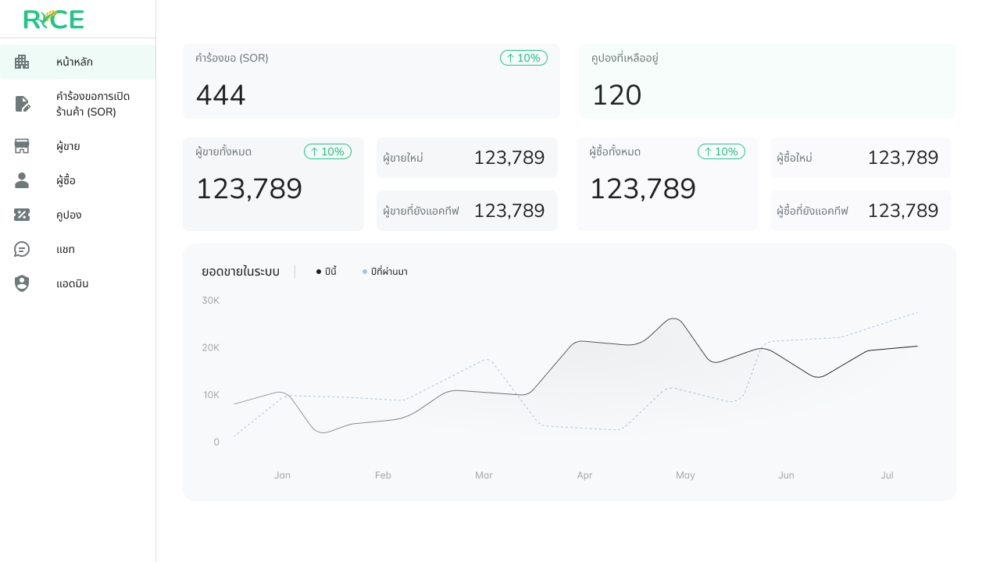

# Admin

* Login

<figure><figcaption></figcaption></figure>

* Dashboard

<figure><figcaption></figcaption></figure>

*   Shop Open Request

    * Overall List

    <figure><figcaption></figcaption></figure>

    * Detail page

<figure><figcaption></figcaption></figure>

* Approve request

<figure><figcaption></figcaption></figure>

* Deny request

<figure><figcaption></figcaption></figure>

* Request fix request

<figure><figcaption></figcaption></figure>

* Seller management

<figure><figcaption></figcaption></figure>

* Seller detail

<figure><figcaption></figcaption></figure>

* Seller product list

<figure><figcaption></figcaption></figure>

* Product detail

<figure><figcaption></figcaption></figure>

* Product review

<figure><figcaption></figcaption></figure>

* Seller order list

<figure><figcaption></figcaption></figure>

* Seller order detail

<figure><figcaption></figcaption></figure>

* Seller report list

<figure><figcaption></figcaption></figure>

* Seller report detail

<figure><figcaption></figcaption></figure>

* Ban seller

<figure><figcaption></figcaption></figure>

* Buyer management

<figure><figcaption></figcaption></figure>

* Buyer detail

<figure><figcaption></figcaption></figure>

* Buyer order history

<figure><figcaption></figcaption></figure>

* Buyer order detail

<figure><figcaption></figcaption></figure>

* Buyer report list

<figure><figcaption></figcaption></figure>

* Buyer report detail

<figure><figcaption></figcaption></figure>

* Ban Buyer

<figure><figcaption></figcaption></figure>

* Coupon management

<figure><figcaption></figcaption></figure>

* Coupon detail

<figure><figcaption></figcaption></figure>

* Create new coupon

<figure><figcaption></figcaption></figure>

* Edit coupon

<figure><figcaption></figcaption></figure>

* Delete coupon

<figure><figcaption></figcaption></figure>

* Chat list

<figure><figcaption></figcaption></figure>

* Chat detail

<figure><figcaption></figcaption></figure>

* Admin management

<figure><figcaption></figcaption></figure>

* Add new admin

<figure><figcaption></figcaption></figure>

* Edit admin

<figure><figcaption></figcaption></figure>

* Delete admin

<figure><figcaption></figcaption></figure>
