# Buyer

## Dashboard

<figure>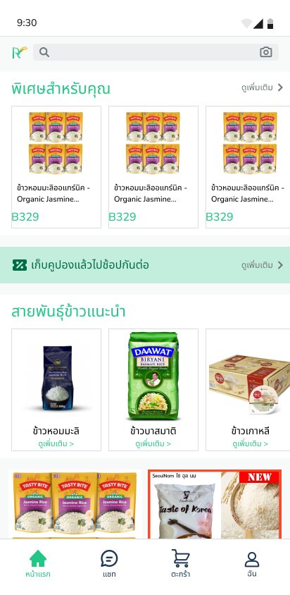<figcaption></figcaption></figure>

 

<figure>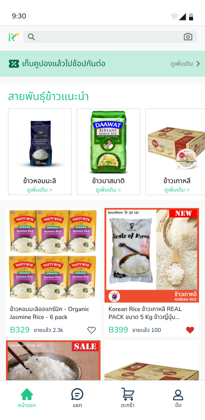<figcaption></figcaption></figure>

## Authentication

### Sign Up

<figure>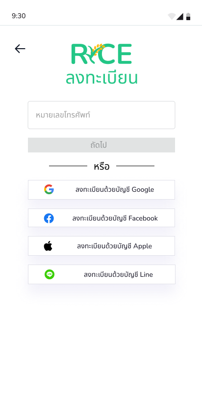<figcaption></figcaption></figure>

 

<figure><figcaption></figcaption></figure>

 

<figure><figcaption></figcaption></figure>

 

<figure><figcaption></figcaption></figure>

***

### Sign In

<figure><figcaption></figcaption></figure>

 

<figure><figcaption></figcaption></figure>

 

<figure><figcaption></figcaption></figure>

<figure><figcaption></figcaption></figure>

* Coupon

<figure><figcaption></figcaption></figure>

* Search

Search with Text

<figure>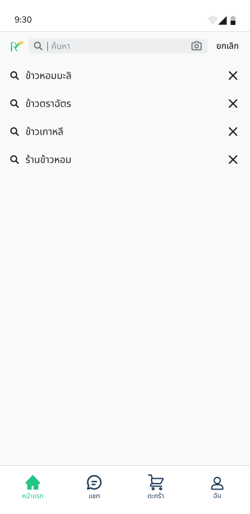<figcaption></figcaption></figure>

 

<figure>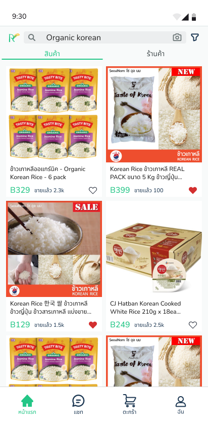<figcaption></figcaption></figure>

 

<figure>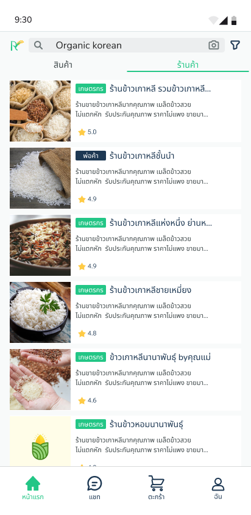<figcaption></figcaption></figure>

 

<figure>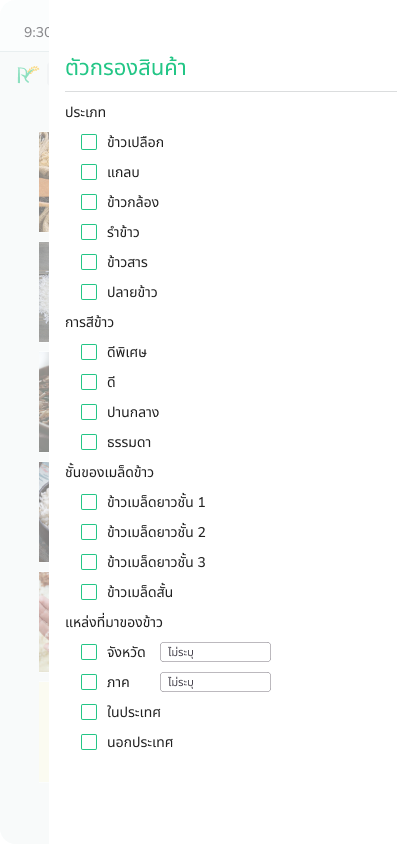<figcaption></figcaption></figure>

&#x20;      Search with Image

<figure>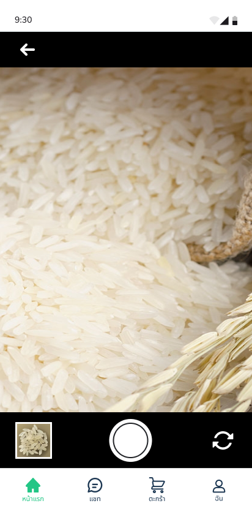<figcaption></figcaption></figure>

 

<figure><figcaption></figcaption></figure>

 

<figure><figcaption></figcaption></figure>

 

<figure><figcaption></figcaption></figure>

 

<figure><figcaption></figcaption></figure>

* Shop page

<figure>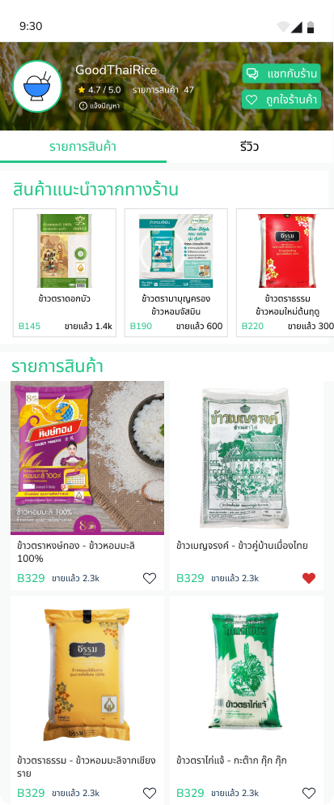<figcaption></figcaption></figure>

 

<figure><figcaption></figcaption></figure>

* Report

<figure><figcaption></figcaption></figure>

 

<figure>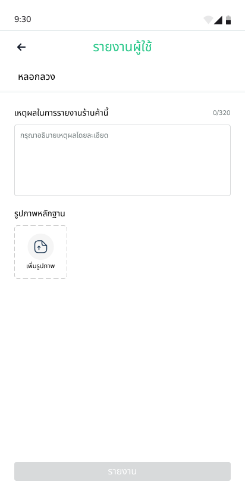<figcaption></figcaption></figure>

 

<figure>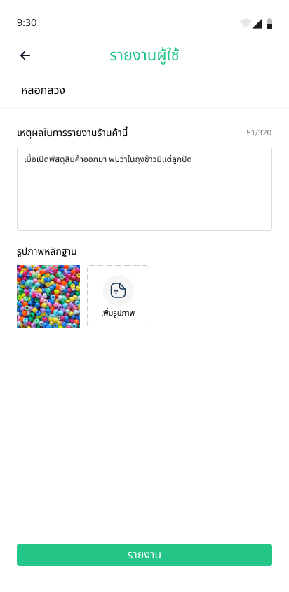<figcaption></figcaption></figure>

* Product detail

<figure><figcaption></figcaption></figure>

 

<figure><figcaption></figcaption></figure>

* Cart

<figure>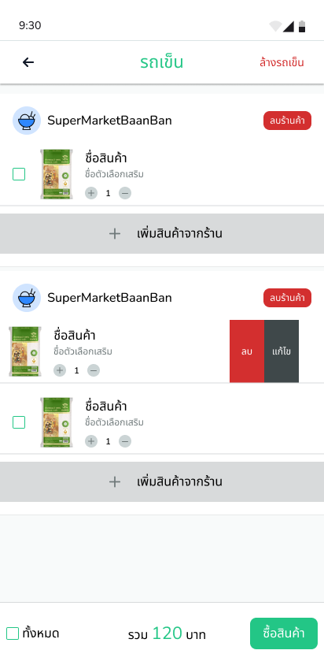<figcaption></figcaption></figure>

* Payment

<figure><figcaption></figcaption></figure>

<figure><figcaption></figcaption></figure>

 

<figure>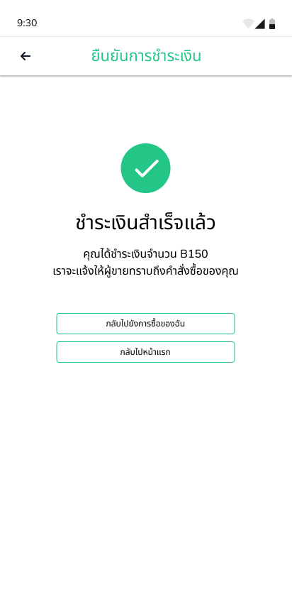<figcaption></figcaption></figure>

* History

<figure><figcaption></figcaption></figure>

 

<figure>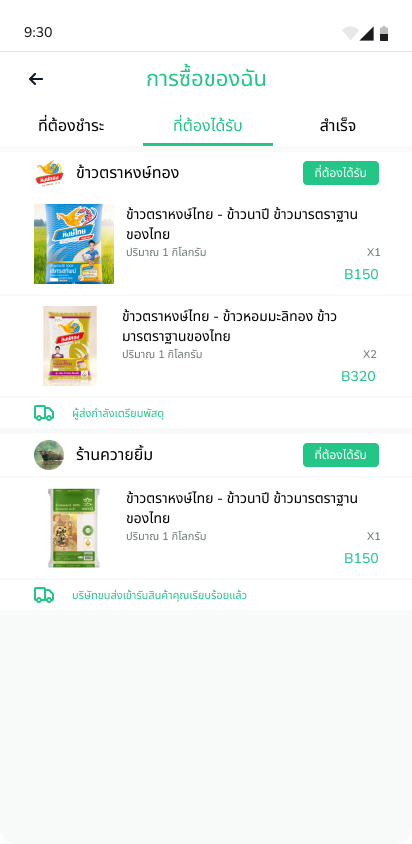<figcaption></figcaption></figure>

 

<figure>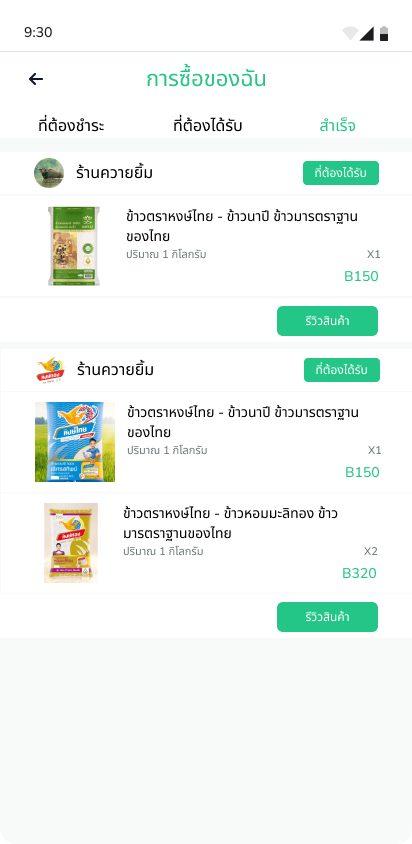<figcaption></figcaption></figure>

* Review

<figure><figcaption></figcaption></figure>

 

<figure><figcaption></figcaption></figure>

<figure><figcaption></figcaption></figure>

 

<figure><figcaption></figcaption></figure>

* User Dashboard

<figure><figcaption></figcaption></figure>

<figure>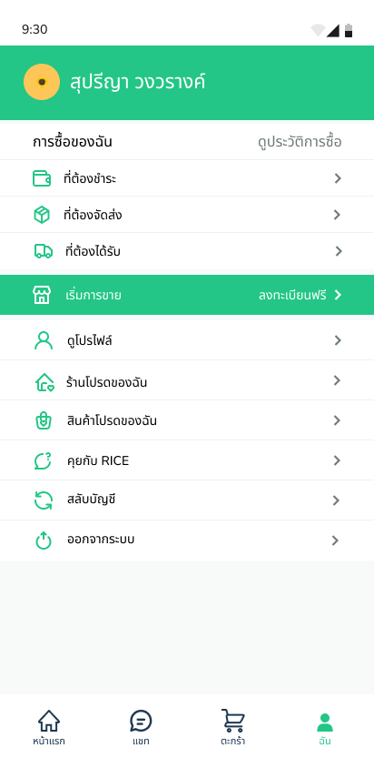<figcaption></figcaption></figure>

ดูโปรไฟล์

<figure>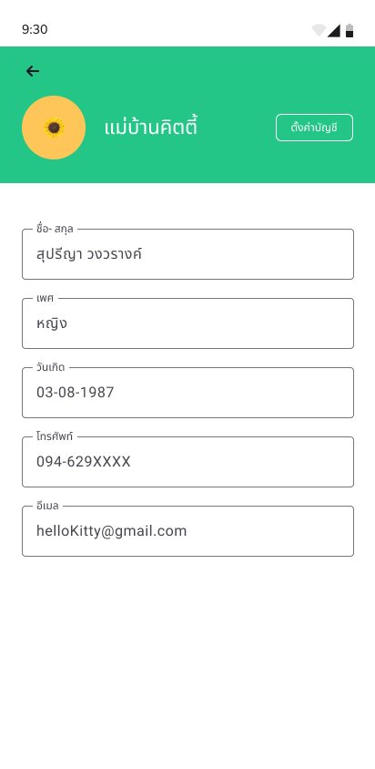<figcaption></figcaption></figure>

ตั้งค่าบัญชี

<figure>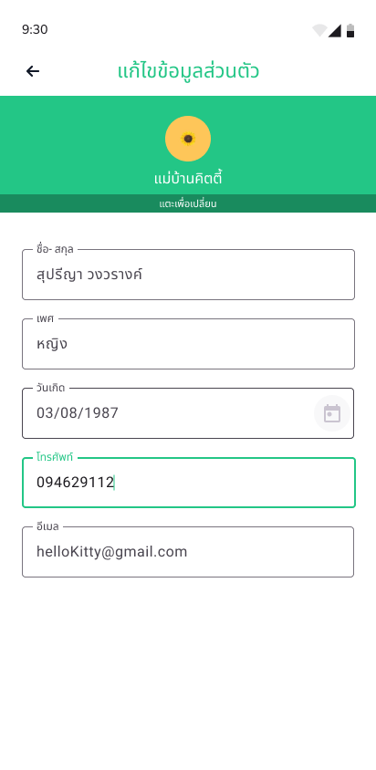<figcaption></figcaption></figure>

ร้านค้าโปรด

<figure><figcaption></figcaption></figure>

สินค้าที่ชอบ

<figure><figcaption></figcaption></figure>

คุยกับ Rice

<figure><figcaption></figcaption></figure>

 

<figure><figcaption></figcaption></figure>

 

<figure><figcaption></figcaption></figure>

สลับบัญชี

<figure><figcaption></figcaption></figure>

* Chat

<figure><figcaption></figcaption></figure>

 

<figure>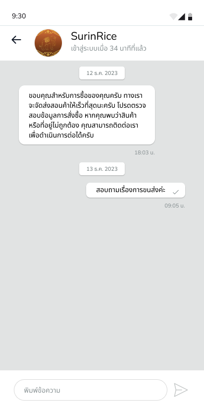<figcaption></figcaption></figure>

 

<figure><figcaption></figcaption></figure>

 

<figure>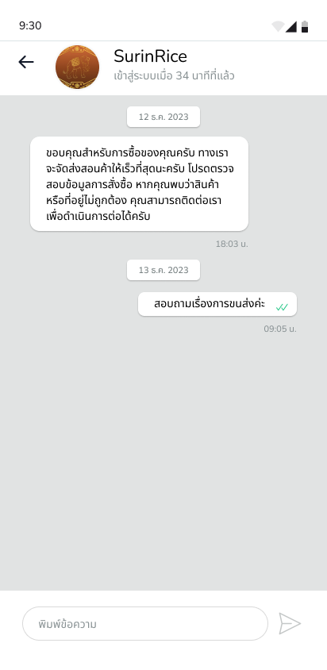<figcaption></figcaption></figure>

