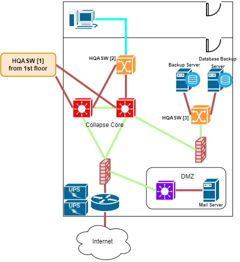
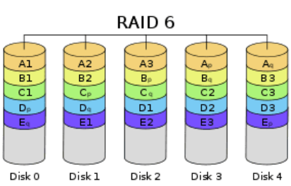

# Datacenter

## Datacenter Physical Topology

<figure><figcaption></figcaption></figure>

## Datacenter Logical Topology

<figure><figcaption></figcaption></figure>

### Egress Layer

Egress Layer เป็นชั้นที่มี Router จำนวน 1 ตัวที่คอยรับ-ส่งข้อมูลออกสู่โลก internet จาก topology ได้ทำการรับ internet  จาก 1 ISP Provider และ Firewall จำนวน 1 ตัว ที่คอยทำหน้าที่ในส่วนของกันป้องกันอันตรายจากอินเทอร์เน็ต

### Access Layer

Access Layer เป็นชั้นที่เชื่อมต่อ end-device ซึ่งประกอบไปด้วย L3 Access Switch 1 ตัว เชื่อมต่อกับ Database Backup Server และ Backup Server

### Server

Server ทั้ง 2 ตัวจะเชื่อมต่อกับ Storage Unit และ Backup Storageโดยที่มี L3 Access Switch เป็นตัวขั้นระหว่าง Server กับ Storage Unit และ Backup Storage

## Storage Unit

### RAID Type

* RAID 6 - Striping with Double Parity

คือการนำ Hard Disk ตั้งแต่ 4 ลูกขึ้นไปมารวมกัน โดยจะเป็นการเขียนข้อมูลกระจายไปทั่วทุก Hard Disk และมี Parity ในชุดนี้ 2 ลูกเพื่อกู้ข้อมูลกรณี Hard Disk ในชุดนี้เสียดังรูป

<figure><figcaption></figcaption></figure>

ข้อมูลชุด A ถูกเขียนกระจายไปบน Disk 0,1,2 และมี Parity อยู่บน Disk 3,4&#x20;

* ข้อดีคือในชุด RAID นี้ คือ Hard Disk สามารถเสียได้สูงสุด 2 ลูกโดยที่ข้อมูลไม่เสียหาย&#x20;
* ข้อเสียก็คือจะเสียพื้นที่ Hard Disk ไป 2 ลูก

### RAID calculation

<figure><figcaption></figcaption></figure>

จากการทำ RAID 6 ใน SAN storage ของ HDD 12 ลูก จะได้พื้นที่ทั้งหมด **80 TB อ่านข้อมูลเร็วขึ้น 10 เท่า และรองรับการเสียของ hard disk ได้ถึง 2 ลูก**
