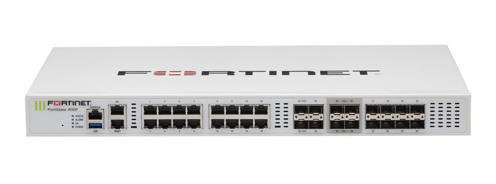
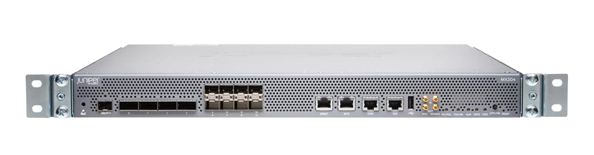
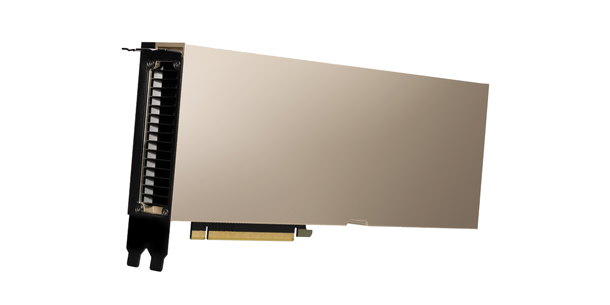

# Network Equipments

## Collapse core switch

**Aruba 8100 24XT4XF4C 3 Fans, 2 AC Power Supplies**

<figure><figcaption></figcaption></figure>

**Specifications:**&#x20;

* I/O ports and slots
  * 24 ports of 100M/1/2.5/5/10GbE/10BaseT
  * 4 ports of 1/GbE/10GbE (SFP/SFP+)
  * 4 ports of 40GbE/100GbE (QSFP+/QSFP28)
* Memory and processor
  * CPU: 1.8 GHz 4-core 64-bit
  * Memory and processor: 16GB RAM, 32GB Flash/Storage
* Performance
  * Switching capacity: 1.36 Tbps
  * Throughput: 1,011 Mpps
  * MAC address table size: 147,456
  * IPv4 host table: 65,536
  * IPv6 host table: 65,536
  * IPv4 unicast routes: 24,576
  * IPv6 unicast routes: 12,288
  * Maximum VLANs: 1,024
* Electrical characteristics
  * Power consumption (230 VAC):
    * 120W Idle Power
    * 400W Max Power
* Price: 604,092.86 THB     \*\*26/2/2024\*\*
*   Reference:

    * Price: [https://www.cdw.com/product/hpe-aruba-networking-cx-8100-24x10gbase-t-4x10g-sfp-4x40-100g-qsfp28-switc/7470236](https://www.cdw.com/product/hpe-aruba-networking-cx-8100-24x10gbase-t-4x10g-sfp-4x40-100g-qsfp28-switc/7470236)
    * Datasheet: [https://www.arubanetworks.com/assets/ds/DS\_8100Series.pdf](https://www.arubanetworks.com/assets/ds/DS\_8100Series.pdf)

## Access switch

**Aruba Instant On 1960 24G 20p Class4 4p Class6 PoE 2XGT 2SFP+ 370W Switch**

<figure><figcaption></figcaption></figure>

**Specifications:**&#x20;

* I/O ports and slots
  * 24 RJ-45 autosensing 10/100/1000 Mbps ports including  20 CL4 and 4 CL6 PoE ports IEEE 802.3 Type 10BASE-T, IEEE 802.3u Type 100BASE-TX, IEEE 802.3ab Type 1000BASE-T, IEEE 802.3at Class 4, IEEE 802.3bt Class 6); Duplex: 10BASE T/100BASE TX: half or full; 1000BASE-T: full only
  * 2 SFP+ 10GbE ports&#x20;
  * 2 10GBASE-T ports
* Memory and processor
  * Single-Core ARM v7 Cortex-A9 @800MHz
  * 1GB DDR3; 512MB NAND flash
* Performance
  * Switching capacity: 128 Gbps
  * Throughput: 95 Mpps
  * MAC address table size: 16,000
  * Routing Table size: 32 IPv4/IPv6
* Electrical characteristics
  * Maximum power rating:
    * 100-127V: 500W&#x20;
    * 200-220V: 480W
  * Idle power:
    * 100-127V: 40W
    * 200-220V: 80W
  * POE power: Total 370 W PoE Power (Up to 240 W of Class 6 or 370 W of Class 4 PoE)
* Price: 25,145 THB     \*\*26/2/2024\*\*
*   Reference:

    * Price: [https://www.2beshop.com/Aruba-Instant-On-1960-24G-20p-Class4-4p-Class6-PoE-2XGT-2SFP+-370W-Switch/JL807A.html?gad\_source=1\&gclid=CjwKCAiAlcyuBhBnEiwAOGZ2Swh0Tc6L9XpNNxT3NiernAdSKSmJuzEsjI6d4rphZUwvZEXleEGtphoC-Y8QAvD\_BwE](https://www.2beshop.com/Aruba-Instant-On-1960-24G-20p-Class4-4p-Class6-PoE-2XGT-2SFP+-370W-Switch/JL807A.html?gad\_source=1\&gclid=CjwKCAiAlcyuBhBnEiwAOGZ2Swh0Tc6L9XpNNxT3NiernAdSKSmJuzEsjI6d4rphZUwvZEXleEGtphoC-Y8QAvD\_BwE)
    * Datasheet: [https://www.hpe.com/psnow/doc/a00118137enw](https://www.hpe.com/psnow/doc/a00118137enw)

## Firewall

**FortiGate 400F**

<figure><figcaption></figcaption></figure>

**Specifications:**&#x20;

* Interfaces
  * Hardware Accelerated GE RJ45 Interfaces: 16
  * Hardware Accelerated GE SFP Slots: 8&#x20;
  * Hardware Accelerated 10GE SFP+ Slots: 4&#x20;
  * Hardware Accelerated 10GE SFP+ Ultra Low Latency Slots: 4&#x20;
  * GE RJ45 Management Ports: 2&#x20;
  * USB Ports: 1&#x20;
  * RJ45 Console Port: 1
* System Performance and Capacity
  * IPS Throughput: 12 Gbps
  * NGFW Throughput: 10 Gbps
  * Threat Protection Throughput: 9 Gbps
  * IPv4 Firewall Throughput (1518 / 512 / 64 byte, UDP): 79.5 / 78.5 / 70 Gbps
  * IPv6 Firewall Throughput (1518 / 512 / 64 byte, UDP): 79.5 / 78.5 / 70 Gbps
  * Firewall Latency (64 byte, UDP): 4.19 μs
  * Firewall Throughput (Packet per Second): 105 Mpps
  * Firewall Policies: 10,000
  * IPsec VPN Throughput (512 byte): 55 Gbps
* Power
  * AC Power Consumption (Average / Maximum): 154.8 W / 189.2 W
* Price: 765,050 THB (License price included)    \*\*26/2/2024\*\*
* License: 1Yr Hardware plus 24x7 Unified Threat Protection (UTP)&#x20;
*   Reference:

    * Price: [https://2beshop.com/FortiGate-400F-Firewall/FG-400F-BDL-950-12.html](https://2beshop.com/FortiGate-400F-Firewall/FG-400F-BDL-950-12.html)
    * Datasheet: [https://www.fortinet.com/content/dam/fortinet/assets/data-sheets/fortigate-400f-series.pdf](https://www.fortinet.com/content/dam/fortinet/assets/data-sheets/fortigate-400f-series.pdf)

## Router

**Juniper router MX204 chassis with 3 fan trays and 2 power supplies**

<figure><figcaption></figcaption></figure>

**Specifications:**&#x20;

* Maximum system throughput: 400 Gbps
* Interface:
  * 8x10GbE
  * 4x100GbE
* Chassis per rack: 42
* Default memory: 32GB DDR4; 2x100 GB SSD
* Number of cores: 8 cores
* Price: 362,890.10 THB     \*\*26/2/2024\*\*
* Reference:
  * Price: [https://www.router-switch.com/mx204.html](https://www.router-switch.com/mx204.html)
  * Datasheet: [https://www.juniper.net/content/dam/www/assets/datasheets/us/en/routers/mx-204-240-480-960-series-universal-routing-platforms-datasheet.pdf](https://www.juniper.net/content/dam/www/assets/datasheets/us/en/routers/mx-204-240-480-960-series-universal-routing-platforms-datasheet.pdf)

## Wireless access point

**UniFi AP AC PRO AC 1750 Mbps 802.11ac 2.4 / 5 Ghz Access Point**

<figure><figcaption></figcaption></figure>

**Specifications:**&#x20;

* Wireless Standards: IEEE 802.11 a/b/g/n/ac
* Antenna: 3 x Dual-Band Antennas,&#x20;
  * 2.4 GHz: 3 dBi
  * 5 GHz: 3 dBi
* Signal Rate: Wireless AC1750
  * 5 GHz: Up to 1300 Mbps
  * 2.4 GHz: Up to 450 Mbps
* Interface: 2x 10/100/1000 Ethernet Ports
* Wireless Transmit Power: 22 dBm
* PoE: Passive Power over Ethernet (48V), 802.3af(Class 3) /802.3at(Class 4) Supported
* Supported Voltage Range: 44 to 57VDC
* Power Consumption: 9W
* Concurrent Clients: 250+
* Price: 8,390 THB     \*\*26/2/2024\*\*
* Reference:
  * Price: [https://www.ubiquiti.asia/product/18342-19608/unifi-ac-pro](https://www.ubiquiti.asia/product/18342-19608/unifi-ac-pro)
  * Datasheet: [https://dl.ubnt.com/datasheets/unifi/UniFi\_AC\_APs\_DS.pdf](https://dl.ubnt.com/datasheets/unifi/UniFi\_AC\_APs\_DS.pdf)

## Server

**GIGABYTE R283-SF1**

<figure><figcaption></figcaption></figure>

**Specifications:**&#x20;

* Processors: 2 x 16 Core Intel® Xeon® Scalable Processor 5416S 4th Gen. 2.00GHZ 30MB L3 Cache TDP 150W - Gold
* RAM Memory: 4 x 32GB PC5-38400 DDR5-4800 Registered ECC Memory Module
* M.2 SSD Storage: 2 x 1.00TB M.2 NVMe SSD Read 7300 MB/s Write 6300 MB/s Client, PCIe 4.0 x4, heatsink (2280) WD\_BLACK™ SN850X
* Chipset: Intel C741 controller
* System Management: Aspeed AST2600 BMC
* Power Supply: 2 x 80 PLUS Titanium power supply 2700W (1008W, 100-127V\~/ 12A / 2700W, 200-240V\~) (25EP0-227000-D0S)
* Mounting Rails: Slide Rail Kit included (25HB2-3A0206-K0R)
* Price: 369,452.31 THB     \*\*26/2/2024\*\*
* Reference:
  * Price and datasheet:



### GPU (for machine learning server)

**Nvidia Tesla A100 40GB GPU SXM4 Ampere Accelarator Graphics Card Deeplearning AI**

<figure><figcaption></figcaption></figure>

**Specifications:**&#x20;

* GPU Memory: 40GB HBM2
* GPU Memory Bandwidth: 1,555GB/s
* Max Thermal Design Power (TDP): 400 W
* Multi-Instance GPU: Up to 7 MIGs @ 5GB
* Form Factor: SXM
* Price: 229,548.13 THB     \*\*26/2/2024\*\*
* Reference:
  * Price: [https://www.ebay.com.au/itm/394740799900?chn=ps&\_ul=AU\&norover=1\&mkevt=1\&mkrid=705-170288-465394-0\&mkcid=2\&itemid=394740799900\&targetid=293946777986\&device=c\&mktype=pla\&googleloc=9073366\&poi=\&campaignid=20874198158\&mkgroupid=154197095902\&rlsatarget=pla-293946777986\&abcId=\&merchantid=7364522\&gad\_source=1\&gclid=CjwKCAiAivGuBhBEEiwAWiFmYUy6CtE1BIx9PioJecCn\_XyDILTNUtUQPp1t7X1m9CRgbmWQ5havEhoCqWIQAvD\_BwE](https://www.ebay.com.au/itm/394740799900?chn=ps&\_ul=AU\&norover=1\&mkevt=1\&mkrid=705-170288-465394-0\&mkcid=2\&itemid=394740799900\&targetid=293946777986\&device=c\&mktype=pla\&googleloc=9073366\&poi=\&campaignid=20874198158\&mkgroupid=154197095902\&rlsatarget=pla-293946777986\&abcId=\&merchantid=7364522\&gad\_source=1\&gclid=CjwKCAiAivGuBhBEEiwAWiFmYUy6CtE1BIx9PioJecCn\_XyDILTNUtUQPp1t7X1m9CRgbmWQ5havEhoCqWIQAvD\_BwE)
  * Datasheet: [https://www.nvidia.com/content/dam/en-zz/Solutions/Data-Center/a100/pdf/nvidia-a100-datasheet-us-nvidia-1758950-r4-web.pdf](https://www.nvidia.com/content/dam/en-zz/Solutions/Data-Center/a100/pdf/nvidia-a100-datasheet-us-nvidia-1758950-r4-web.pdf)

## FC/SAN switch

**Dell Connectrix DS-6610B Switch**

<figure><figcaption></figcaption></figure>

**Specifications:**&#x20;

* Fibre Channel Ports:
  * 24 x 32Gb SFP+
  * 8 x Active Ports
* Performance:&#x20;
  * 32Gb/s SFPs can operate at 32, 16 or 8Gb/s. &#x20;
  * 16Gb/s SFPs will operate at 16, 8 and 4Gb/s.
* Aggregate Bandwidth: 768 Gb/s
* Frame Buffers: 2K dynamically allocated
* Maximum Frame Size: 2,112-byte payload
* Price: 79,574.89 THB     \*\*26/2/2024\*\*
* Reference:
  * Price: [https://www.etb-tech.com/dell-connectrix-ds-6610b-switch-24-x-32gb-sfp-8-x-active-ports-sw02192.html](https://www.etb-tech.com/dell-connectrix-ds-6610b-switch-24-x-32gb-sfp-8-x-active-ports-sw02192.html)
  * Datasheet: [https://www.gotomojo.com/wp-content/uploads/2019/07/Dell-Connectrix-Switch-DS-6600B-Tech-Specs.pdf](https://www.gotomojo.com/wp-content/uploads/2019/07/Dell-Connectrix-Switch-DS-6600B-Tech-Specs.pdf)

## Storage unit

**Dell PowerVault ME5012 Storage Array**

<figure><figcaption></figcaption></figure>

**Specifications:**&#x20;

* Model: Dell PowerVault ME5012 Storage Array
* Controller Cards: 25Gb iSCSI 8 Port Dual Controller
* Rack Rails: Rack Rails 2U
* Bezel: ME Series 2U Bezel
* RAID support: RAID 1, 5, 6, 10, or ADAPT RAID; any combination of RAID levels can exist in single array
* Power Supply: Power Supply, 580W, Redundant, CE Marking
* Power Cords: Power Cord - C13, 2M, 250V, 10A (Thailand)
* Power Cords: Jumper Cord - C13/C14, 4M, 250V, 10A (US, EU, TW, APCC countries except ANZ)
* Price: 501,000 THB     \*\*26/2/2024\*\*
* Reference:
  * Price: [https://www.innovation-tech.co.th/product/36265-40118/dell-me5012-storage-array](https://www.innovation-tech.co.th/product/36265-40118/dell-me5012-storage-array)
  * Datasheet: [https://www.delltechnologies.com/asset/en-us/products/storage/technical-support/dell-powervault-me5-ss.pdf](https://www.delltechnologies.com/asset/en-us/products/storage/technical-support/dell-powervault-me5-ss.pdf)

### Hard disk drive

**Dell 8TB 7.2K RPM NLSAS 12Gbps 4Kn 3.5in Hot-Plug Hard Drive**

<figure><figcaption></figcaption></figure>

## UPS

**Cleanline UPS T Series (Tower) 10000VA / 10000Watt True On-Line Double Conversion T-10K**

<figure><figcaption></figcaption></figure>

**Specifications:**&#x20;

* Power rating: 10kVA/10kW
* Input Voltage: 110-300Vac at 50% Load, 220Vac ±20% at 100% load (±27%Option)
* Input Phase: Single phase with ground
* Output Voltage: 208/220/230/240Vac
* Surge protection: 220V (IEEEC6100-4-5 level 3)
* Overload protection: UPS Automatic bypass if overload between 110% to 130% at 60 seconds and more than 130% at 1 seconds
* Short circuit protection: UPS Output cut off immediately or input fuse/circuit breaker protection
* Price: 110,500 THB     \*\*26/2/2024\*\*
* Reference:
  * Price and datasheet: [https://www.compware-agency.com/product/1047/cleanline-ups-t-series-tower-10000va-10000watt-true-on-line-double-conversion-t-10k-price-excluded-v](https://www.compware-agency.com/product/1047/cleanline-ups-t-series-tower-10000va-10000watt-true-on-line-double-conversion-t-10k-price-excluded-v)

## Transceiver modules

#### For collapse core switch

* **HP Aruba Compatible Transceiver SFP+ 10GBase-SR (850nm, MMF, 300m, DOM)**

<figure><figcaption></figcaption></figure>

**Specifications:**&#x20;

* Model: JL748A
* Form Factor: SFP+
* Connector Type: LC
* Data Transfer Rate: 10 Gbps
* Max Transfer Distance: 300 m
* Cabling Type: MMF
* Price: 1,020 THB     \*\*26/2/2024\*\*
*   Reference:

    * Price: [https://atgbics.com/products/jl748a-hp-aruba-compatible-transceiver-sfp-10gbase-sr-850nm-mmf-300m-dom](https://atgbics.com/products/jl748a-hp-aruba-compatible-transceiver-sfp-10gbase-sr-850nm-mmf-300m-dom)

#### For access switch

* **Aruba Instant On 10G SFP+ LC SR 300m MMF Transceiver Multi-Mode**

<figure><figcaption></figcaption></figure>

**Specifications:**&#x20;

* Model: R9D18A
* Form Factor: SFP+
* Connector Type: LC
* Data Transfer Rate: 10 Gbps
* Max Transfer Distance: 300 m
* Cabling Type: 10GBase-sr
* Data Link Protocol: 10 Gige
* Price: 3,430 THB     \*\*26/2/2024\*\*
* Reference:
  * Price: [https://www.lazada.co.th/products/aruba-instant-on-10g-sfp-lc-sr-300m-mmf-transceiver-multi-mode-r9d18a-i4177404838-s16426341649.html?spm=a2o4m.tm80167383.2074280300.1.1646ogQoogQovj.1646ogQoogQovj](https://www.lazada.co.th/products/aruba-instant-on-10g-sfp-lc-sr-300m-mmf-transceiver-multi-mode-r9d18a-i4177404838-s16426341649.html?spm=a2o4m.tm80167383.2074280300.1.1646ogQoogQovj.1646ogQoogQovj)

#### For firewall

* **FR-TRAN-SX - Fortinet Compatible 1000BASE-SX SFP 850nm 550m DOM I-TEMP Transceiver Module**

<figure><figcaption></figcaption></figure>

**Specifications:**

* Form Factor: SFP+
* Connector Type: LC
* Data Transfer Rate: 10 Gbps
* Max Transfer Distance: 300 m
* Cabling Type: 10GBase-sr
* Data Link Protocol: 10 Gige
* Price: 3,188 THB     \*\*26/2/2024\*\*
* Reference:
  * Price: [https://th.gbics.com/fs-tran-sfp-sr-fortinet-compatible-10gbase-sr-sfp-850nm-300m-dom-transceiver-module/](https://th.gbics.com/fs-tran-sfp-sr-fortinet-compatible-10gbase-sr-sfp-850nm-300m-dom-transceiver-module/)
