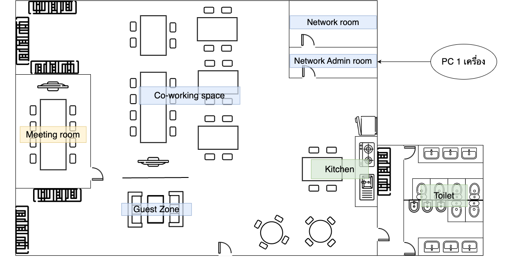

# Floor Plan

## Headquarter

สำนักงานใหญ่จะแบ่งออกเป็น 2 ชั้น

### First Floor

ชั้นแรกของสำนักงานใหญ่จะแบ่งพื้นที่ออกเป็น 11 ส่วน ดังนี้

1. Customer Support - 1 room
2. Marketing - 1 room
3. Human Resources - 1 room
4. Finance - 1 room
5. Chief Room - 5 rooms
6. Co-working Space - Area
7. Kitchen - Area
8. Toilet - Seperate Male and Female
9. Storage Room - 1 room
10. Guest Zone - Area
11. Meeting Room - 3 rooms

<figure><figcaption>
Headquarter First Floor - Floor Plan
</figcaption></figure>

### Second Floor

ชั้นที่สองของสำนักงานใหญ่จะแบ่งพื้นที่ออกเป็น 7 ส่วน ดังนี้

1. Data Center - 1 room
2. Network Admin Room - 1 room with 1 pc
3. Document Room
4. Developer Working Space - Area
5. Toilet - Seperate Male and Female
6. Meeting Room - 2 rooms
7. IT Room - 1 room

<figure><figcaption>
Headquarter Second Floor - Floor Plan
</figcaption></figure>

## Branch

สาขาย่อยมีชั้นเดียว และการแบ่งพื้นที่ออกเป็น ส่วน มีดังนี้

1. Meeting Room - 1 room
2. Co-working Space - Area
3. Network Room - 1 room
4. Network Admin Room - 1 room with 1 pc
5. Kitchen - Area
6. Toilet -Seperate Male and Female
7. Guest Zone - Area

<figure><figcaption>
Branch - Floor Plan
</figcaption></figure>
